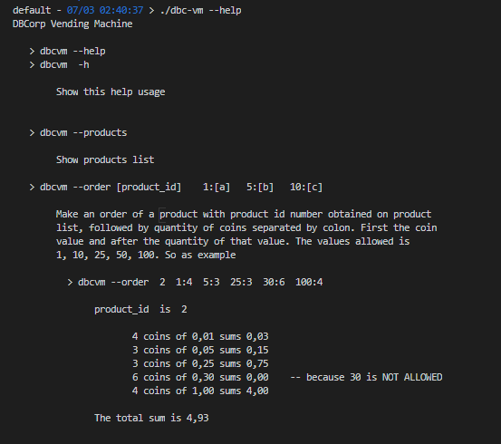
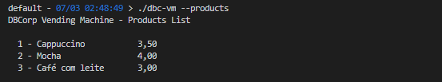
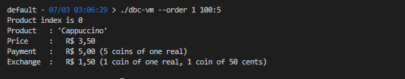
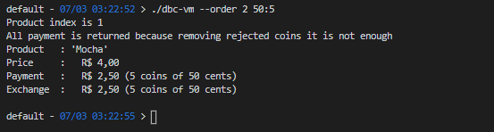
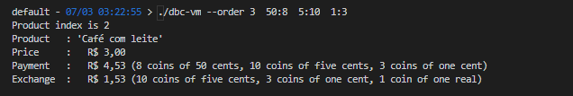

## **DB Corp**

Evaluation project for **DB Corp** Company

- [Specification](documents/DBCorp%20/%20Teste%20de%20recrutamento.pdf)

- [References used](documents/references.md)
  
  
-----

This implementation is a console application with parameters passed through the command line. To know how to use it, it must be executed without any parameter or with '--help' or '-h' as the first parameter, resulting in the explanation shown in 'Image 1'.  

 ```

    > ./dbc-vm --help
 
 ```

   
  
  
    
 ### Examples of use

 Obtendo a lista de produtos

 ```

    > ./dbc-vm --products

 ```

   
 
   
   

Ordering the item with index 1 (Cappuccino) using only one dollar coins in sufficient quantity, resulting only in the return of the calculated change.  

 ```

    > ./dbc-vm --order 2 100:5

 ```
 
 
 

Ordering the item with index 2 using only 50 cent coins, BUT in NOT enough balance.

 ```

    > ./dbc-vm --order 2 50:5

 ```
 


Ordering the item with index 3 using 50 cent coins, and some 5 cent and 1 cent coins that will be returned following the rules.

 ```

    > ./dbc-vm --order 3 50:8  5:10  1:3

 ```
 


 
 

